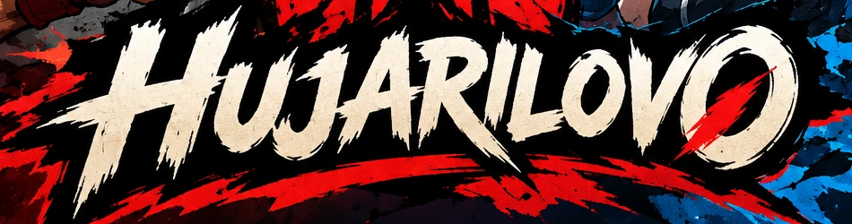

# HUJARILOVO

*Browser Combat Game — рабочее название.*

Браузерная PvP-игра 1v1 для двух друзей. Каждый раунд оба одновременно выбирают две вещи: **за какую створку встать** (лево / центр / право) и **какую створку пронзить**. Фонари вспыхивают, клинки рвут бумагу, и становится видно, кто кого прочитал.

Серии чтений, растущее напряжение пустых раундов, рвущаяся арена и Досье привычек превращают простую угадайку в дуэль характеров и блефа. Матч длится 3–6 минут, после него хочется только одного — «Требую реванша».

## Документы

- [`docs/concept.md`](docs/concept.md) — полный game design concept: правила, системы, психология, примеры матчей, визуальный стиль, UI/UX.
- [`docs/branding.md`](docs/branding.md) — логотип, палитра, шрифты, открытые вопросы по арту.

## Статус

Этап концепции. Кода ещё нет, следующий шаг — прототип.
