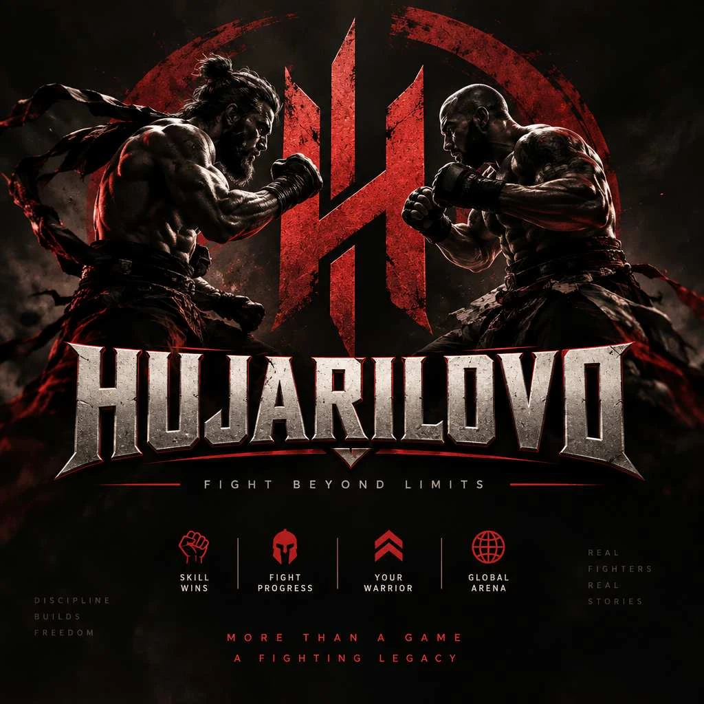

# HUJARILOVO — брендинг

Рабочее (тестовое) название — **HUJARILOVO**. Слоган — **FIGHT BEYOND LIMITS**.

## Настроение
Подпольные бои без перчаток: темнота, пыль, багровый свет, стальные буквы. Двое против друг друга, между ними — красная эмблема. Тяжело, сурово, без мультяшности. Главные слова бренда: дисциплина, мастерство, легенда.

Слоганы с борда, которые используем в интерфейсе и промо:
- FIGHT BEYOND LIMITS — главный, под логотипом
- MORE THAN A GAME · A FIGHTING LEGACY
- DISCIPLINE BUILDS FREEDOM
- REAL FIGHTERS · REAL STORIES
- SKILL WINS · FIGHT PROGRESS · YOUR WARRIOR · GLOBAL ARENA — подписи к иконкам

## Файлы

| Файл | Что это |
|---|---|
| `brand/brand-board.webp` | Исходный бренд-борд, 1024×1024 |
| `brand/key-art.webp` | Верхняя часть борда: два бойца и эмблема. Фон главного меню |
| `brand/wordmark.webp` | Логотип-надпись со слоганом, вырезан с борда (на тёмном фоне) |
| `brand/emblem.svg` | Эмблема-монограмма «H» в круге, перерисована в векторе. Фавикон и иконка |

Копии для игры лежат в `client/public/brand/`.

## Логотип
- **Надпись HUJARILOVO:** тяжёлые рубленые капители из потёртой стали с красной обводкой, снизу красная дуга с треугольным зубцом.
- **Эмблема:** красная монограмма «H» из двух клинков, связанных диагональю, внутри рваного красного кольца.
- На тёмном фоне логотип ставится как есть. Светлых фонов у бренда нет.

## Палитра

| Цвет | HEX | Роль |
|---|---|---|
| Уголь | `#070806` | Фон |
| Графит | `#16171A` | Панели, карточки |
| Графит-линия | `#2A2B2F` | Разделители, рамки |
| Кровь | `#C1272D` | Главный акцент, кнопки, «ты» на арене |
| Тёмная кровь | `#6E1414` | Тени акцента, кольцо эмблемы, урон |
| Сталь | `#D9D0C8` | Заголовки, логотип, «соперник» на арене |
| Сталь-тень | `#8E857E` | Фактура стали, неактивные элементы |
| Пепел | `#9A948F` | Второстепенный текст |

На арене **ты всегда красный, соперник — стальной**: у каждого игрока на своём экране.

## Типографика
- **Oswald** (пакет `@fontsource/oswald`, встроен в сборку, есть кириллица): заголовки 700 капсом, подписи 300–400 капсом с разрядкой 0.3–0.4em, как у «FIGHT BEYOND LIMITS».
- Основной текст — системный гротеск.

## Иконки
Контурные красные пиктограммы толщиной 2px: кулак, шлем, шеврон, глобус. В игре рисуются инлайн-SVG, чужие наборы иконок не используем.

## Правила
- Бойцы на ключевом арте оригинальные. Новые персонажи и арт — тоже только оригинальные, без узнаваемых героев чужих игр.
- Всё, что взято со стороны (шрифты, звуки), записывается в `docs/assets-registry.md`.
